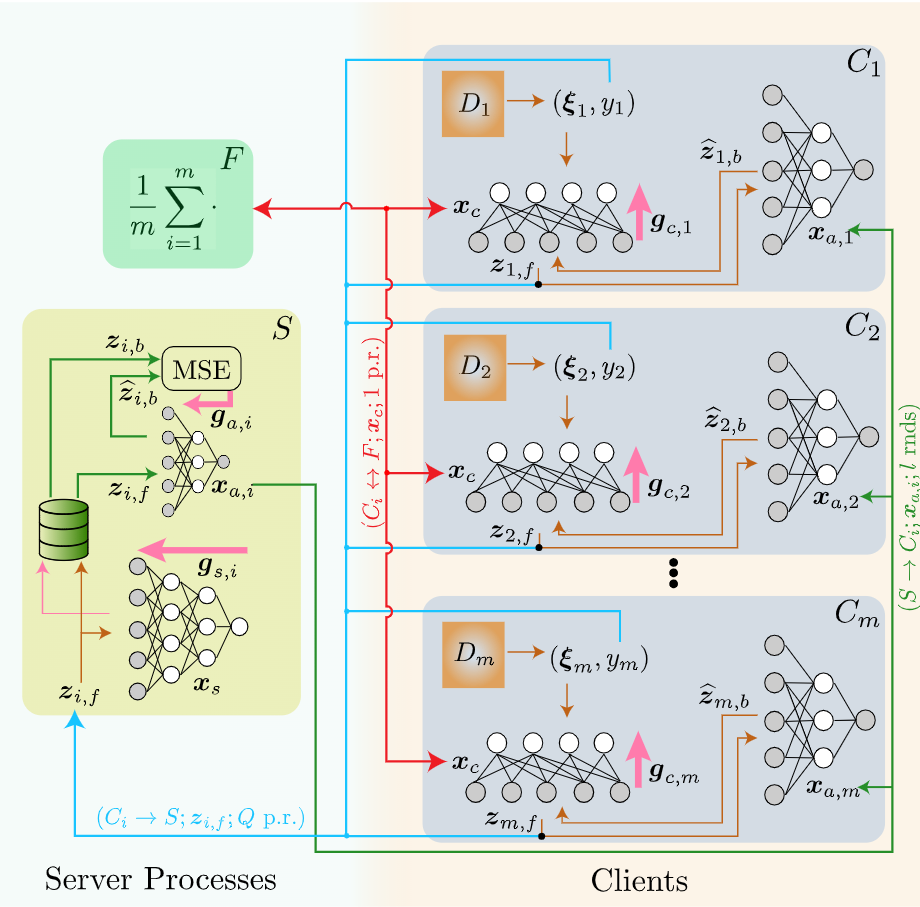

# FSL-SAGE: Federated Split Learning via Smashed Activation Gradient Estimation

## Introduction

Our Federated Split Learning (FSL) algorithm cuts down on communication
overheads in traditional Split Learning methods by directly estimating
server-returned gradients at each client using auxiliary models.  The auxiliary
models are much smaller versions of the server model which are explicitly
trained to estimate the gradients that the server model would return for the
client's local input.

The algorithm is summarized in the following schematic:
<div align="center">

</div>

## Requirements
The project requirements can be simply installed using the environment config
file [`conda_env.yaml`](conda_env.yaml) as follows:
```python
conda env create -f conda_env.yaml
```

## Configuration 
This project is powered by [Hydra](https://hydra.cc/docs/intro/), which allows
hierarchical configurations and easy running of multiple ML experiments.
The config files for hydra are located in the folder
[`hydra_config`](src/hydra_config).

There is a high degree of customizability here; datasets, models and FL
algorithms can be plugged in using configs.

## Running
To run FSL-SAGE with defaults from [`hydra_config`](src/hydra_config), you can
simply run
```bash
python main.py
```

To choose a specific model or algorithm, the Hydra
[command-line override](https://hydra.cc/docs/advanced/override_grammar/basic/)
functionality can be used
```bash
python main.py model=resnet18 algorithm=cse_fsl
```

We also support multiruns in parallel using the
[hydra-joblib-launcher](https://hydra.cc/docs/plugins/joblib_launcher/)
Thus, it is possible to run multiple experiments for different combinations of hyperparams, models, datasets or algorithms.
```bash
python main.py -m model=resnet18,simple_conv algorithm=fed_avg,sl_single_server,sl_multi_server,cse_fsl,fsl_sage
```
The above would create parallel jobs that would run main.py on all combinations
of specified options

[//]: <> (## Citation)
[//]: <> (If you use this code in your research, please cite this paper.)

[//]: <> (```)
[//]: <> (@article{mu2023communication,)
[//]: <> (  title={Communication and Storage Efficient Federated Split Learning},)
[//]: <> (  author={Mu, Yujia and Shen, Cong},)
[//]: <> (  journal={arXiv preprint arXiv:2302.05599},)
[//]: <> (  year={2023})
[//]: <> (})
[//]: <> (```)