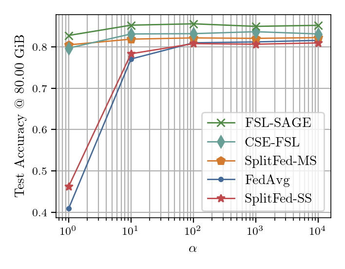
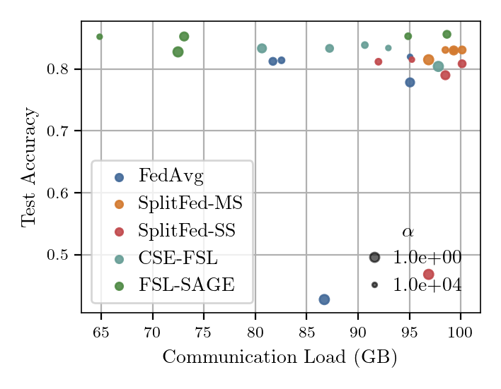
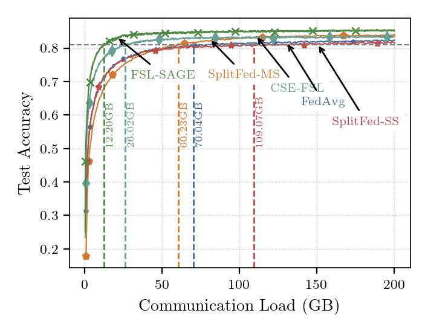

## Inference Scripts

The following scripts are provided for conveniently reproducing the plots in our
paper:

 - [`plots_results.py`](./plot_results.py): Contains scripts for plotting the
 following:
    1. Test metrics, e.g. accuracy, loss, etc., against training rounds or
    communication load.
    2. Test metrics against the $\alpha$ parameter of the Dirichlet distribution.
    3. Scatter plot of accuracy vs. communication load for various methods and
    their $\alpha$ parameters.
    4. Print tables of accuracy and communication load values for various
    methods.

 - [`plots_ablations.py`](./plot_ablations.py): Contains simple functions for
 plotting the ablation results and latency plots in the paper.  The following
 ablation studies are included:
    1. Effect of auxiliary model size on final test performance
    2. Effect of auxiliary alignment interval on final test performance
    3. Computation and communication latency of various methods including
    FSL-SAGE.

### How to use [`exp_config.yaml`](./exp_config.yaml)?

The functions in plot_results.py are written to read the experiment
configurations from [`exp_config.yaml`](./exp_config.yaml).

The initial part of the file contains the following 'metadata':
```yaml
prefix_dir : ../saves   # <- permanent location to look for save directories of
                        # all the experiment runs
plots_dir  : ../plots   # <- permanent location to save all plots
plots      : True       # <- whether to generate plots for the experiments below
table      : True       # <- whether to generate tables

name_folder:            # mapping between the algorithm and its folder name
  FedAvg : fed_avg
  SplitFed-MS : sl_multi_server
  SplitFed-SS : sl_single_server
  CSE-FSL : cse_fsl
  FSL-SAGE : fsl_sage

experiments:
    ...
```

Each new entry under the `experiments` key would have the following format:
```yaml
  cifar10/resnet18/noniid:  # <- example directory name to save plots; this can
                            # be a free choice
    disable: false     # choose to run this experiment? true - no, false - yes
    title : CIFAR10; non_iid; ResNet18  # title and description can be anything
                                        # you choose
    type : metric_comm_scatter  # type of experiment.  If type is not specified,
                                # it runs the default accuracy vs communication
                                # load or rounds plot
    desc  : metrics vs communication load scatter plot
    test_ids: [0, 1, 2, 3, 4]   # From the main keys in `save_locs` below,
                                # choose these IDs (starting from 0) to plot

    # The values for (model, dataset, distribution) determine the directory hierachy within ../saves to use for the save locations specified below
    model : resnet18            # Model being tested
    dataset : cifar10           # Dataset used for testing
    distribution : noniid_dirichlet     # Distribution used

    # The save_locs key specifies the directory locations for the runs being
    # tested.  Note that the format for specifying save locations may be different for each `type` of experiment
    save_locs:          
      FedAvg:       # <- name of the algorithm used

        # specify below the alpha parameter as the key and the directory
        # location as the value
        0.01   : R200m3E1B128-alp1.00e-02-seed200/250102-151728
        0.1    : R200m3E1B128-alp1.00e-01-seed200/250102-151728
        1.0    : R200m3E1B128-alp1.00e+00-seed200/250102-151728
        10.0   : R200m3E1B128-alp1.00e+01-seed200/250102-151728
        100.0  : R200m3E1B128-alp1.00e+02-seed200/250102-151728
        1000.0 : R200m3E1B128-alp1.00e+03-seed200/250102-151728
        10000.0: R200m3E1B128-alp1.00e+04-seed200/250102-151729
      SplitFed-MS:
        0.01   : R200m3E1B128-alp1.00e-02-seed200/250102-151728
        0.1    : R200m3E1B128-alp1.00e-01-seed200/250102-160829
        1.0    : R200m3E1B128-alp1.00e+00-seed200/250102-161100
        10.0   : R200m3E1B128-alp1.00e+01-seed200/250102-161108
        100.0  : R200m3E1B128-alp1.00e+02-seed200/250102-161110
        1000.0 : R200m3E1B128-alp1.00e+03-seed200/250102-161323
        10000.0: R200m3E1B128-alp1.00e+04-seed200/250102-161326
      SplitFed-SS:
        0.01   : R200m3E1B128-alp1.00e-02-seed200/250102-161333
        0.1    : R200m3E1B128-alp1.00e-01-seed200/250102-161448
        1.0    : R200m3E1B128-alp1.00e+00-seed200/250102-170141
        10.0   : R200m3E1B128-alp1.00e+01-seed200/250102-170214
        100.0  : R200m3E1B128-alp1.00e+02-seed200/250102-170301
        1000.0 : R200m3E1B128-alp1.00e+03-seed200/250102-170444
        10000.0: R200m3E1B128-alp1.00e+04-seed200/250102-170528
      CSE-FSL:
        0.01   : R200m3E1B128q5-alp1.00e-02-seed200/241223-003939
        0.1    : R200m3E1B128q5-alp1.00e-01-seed200/241223-013139
        1.0    : R200m3E1B128q5-alp1.00e+00-seed200/241223-013300
        10.0   : R200m3E1B128q5-alp1.00e+01-seed200/241223-013301
        100.0  : R200m3E1B128q5-alp1.00e+02-seed200/241223-013302
        1000.0 : R200m3E1B128q5-alp1.00e+03-seed200/241223-013307
        10000.0: R200m3E1B128q5-alp1.00e+04-seed200/241223-013329
      FSL-SAGE:
        0.01   : R200m3E1B128q5l10-alp1.00e-02-seed200/241223-003938
        0.1    : R200m3E1B128q5l10-alp1.00e-01-seed200/241223-003938
        1.0    : R200m3E1B128q5l10-alp1.00e+00-seed200/241223-003938
        10.0   : R200m3E1B128q5l10-alp1.00e+01-seed200/241223-003938
        100.0  : R200m3E1B128q5l10-alp1.00e+02-seed200/241223-003938
        1000.0 : R200m3E1B128q5l10-alp1.00e+03-seed200/241223-003938
        10000.0: R200m3E1B128q5l10-alp1.00e+04-seed200/241223-003938
```

The following experiment `type`s are supported currently:
 - `dirichlet_alpha` : Plots the accuracy of test accuracy vs. $\alpha$ of the
    Dirichet distribution to test for robustness of the method to data
    heterogeneity.  The resulting plot would look like the following:
    <div align="center">
    
    </div>


 - `metric_comm_scatter` : Plots a scatter plot with communication load on the
    x-axis and test accuracy on the y-axis.  The resulting plot would look like the following:
    <div align="center">
    
    </div>

The specification of `save_locs` for `dirichlet_alpha` and `metric_comm_scatter`
is the same as in the example above.  If the `type` property is not specified,
the default accuracy vs. communication load or rounds is plotted and would look
like the following:

<div align="center">

</div>
